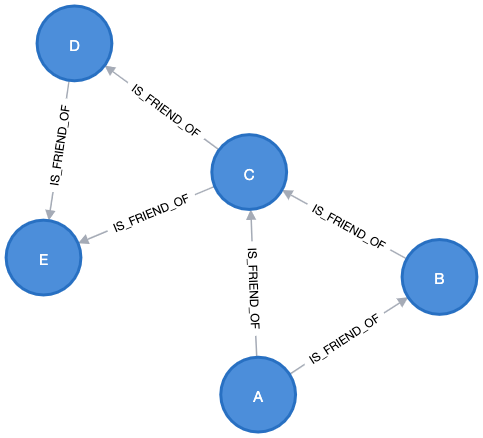
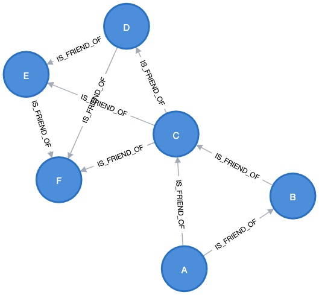

This repo is a demonstration of [friendship paradox](https://en.wikipedia.org/wiki/Friendship_paradox#:~:text=The%20friendship%20paradox%20is%20the,in%20one's%20own%20friend%20group.) using Neo4j.

TLDR; On average, your friend has more friends than you do.

-------------------------------------------
# Dataset 1
```
CREATE (a: Person {name: "A"}),
(b: Person {name: "B"}),
(c: Person {name: "C"}),
(d: Person {name: "D"}),
(e: Person {name: "E"}),
(a)-[:IS_FRIEND_OF]->(b),
(a)-[:IS_FRIEND_OF]->(c),
(b)-[:IS_FRIEND_OF]->(c),
(c)-[:IS_FRIEND_OF]->(d),
(c)-[:IS_FRIEND_OF]->(e),
(d)-[:IS_FRIEND_OF]->(e)
```
To display all `person` nodes
```
MATCH (person) RETURN person
```


To list nodes and counts
```
MATCH (f1)-[r1]-(f2) 
WITH f1 , COUNT(r1) AS nf, f2
MATCH (f2)-[r2]-(f3)
WITH f1, nf, f2, COUNT(r2) AS nff
WITH f1, nf, f2, SUM(nff) AS nff
WITH f1, SUM(nf) AS nf, COLLECT(f2) AS f2, COLLECT(nff) AS nffList, SUM(nff) AS nff
RETURN f1, nf, f2, nffList, nff, size(nffList) AS s
ORDER BY f1
```
- f1: friend1 / starting person
- nf: count of friends of f1
- f2: friend(s) of f1
- nffList: for each f2 = friend of f1, count the number of friends they have
- nff: sum of the nffList array
- s: size of nffList array
```
╒═════════════════════╤═══╤══════════════════════════════════════════════════════════════════════╤════════════╤═══╤═══╕
│f1                   │nf │f2                                                                    │nffList     │nff│s  │
╞═════════════════════╪═══╪══════════════════════════════════════════════════════════════════════╪════════════╪═══╪═══╡
│(:Person {name: "A"})│2  │[(:Person {name: "B"}), (:Person {name: "C"})]                        │[2, 4]      │6  │2  │
├─────────────────────┼───┼──────────────────────────────────────────────────────────────────────┼────────────┼───┼───┤
│(:Person {name: "B"})│2  │[(:Person {name: "A"}), (:Person {name: "C"})]                        │[2, 4]      │6  │2  │
├─────────────────────┼───┼──────────────────────────────────────────────────────────────────────┼────────────┼───┼───┤
│(:Person {name: "C"})│4  │[(:Person {name: "A"}), (:Person {name: "B"}), (:Person {name: "D"}), │[2, 2, 2, 2]│8  │4  │
│                     │   │(:Person {name: "E"})]                                                │            │   │   │
├─────────────────────┼───┼──────────────────────────────────────────────────────────────────────┼────────────┼───┼───┤
│(:Person {name: "D"})│2  │[(:Person {name: "C"}), (:Person {name: "E"})]                        │[4, 2]      │6  │2  │
├─────────────────────┼───┼──────────────────────────────────────────────────────────────────────┼────────────┼───┼───┤
│(:Person {name: "E"})│2  │[(:Person {name: "C"}), (:Person {name: "D"})]                        │[4, 2]      │6  │2  │
└─────────────────────┴───┴──────────────────────────────────────────────────────────────────────┴────────────┴───┴───┘
```
To calculate the average count of friends
```
MATCH (f1)-[r1]-(f2) 
WITH f1 , COUNT(r1) AS nf, f2
MATCH (f2)-[r2]-(f3)
WITH f1, nf, f2, COUNT(r2) AS nff
WITH f1, nf, f2, SUM(nff) AS nff
WITH f1, SUM(nf) AS nf, COLLECT(f2) AS f2, COLLECT(nff) AS nffList, SUM(nff) AS nff
WITH f1, nf, f2, nffList, nff, size(nffList) AS s, COUNT(*) AS numRows
RETURN SUM(nf) * 1.0 / SUM(numRows) AS avgNumOfFriends, SUM(nff) * 1.0 / SUM(s) AS avgNumOfFriendsOfFriends
```
Your friends has 2.67 friends while you have 2.4 friends on avg.
```
╒═══════════════╤════════════════════════╕
│avgNumOfFriends│avgNumOfFriendsOfFriends│
╞═══════════════╪════════════════════════╡
│2.4            │2.6666666666666665      │
└───────────────┴────────────────────────┘
```
-------------------------------------------
# Repeat the process for dataset 2
```
CREATE (a: Person {name: "A"}),
(b: Person {name: "B"}),
(c: Person {name: "C"}),
(d: Person {name: "D"}),
(e: Person {name: "E"}),
(f: Person {name: "F"}),
(a)-[:IS_FRIEND_OF]->(b),
(a)-[:IS_FRIEND_OF]->(c),
(b)-[:IS_FRIEND_OF]->(c),
(c)-[:IS_FRIEND_OF]->(d),
(c)-[:IS_FRIEND_OF]->(e),
(c)-[:IS_FRIEND_OF]->(f),
(d)-[:IS_FRIEND_OF]->(e),
(d)-[:IS_FRIEND_OF]->(f),
(e)-[:IS_FRIEND_OF]->(f)
```


```
╒═════════════════════╤═══╤══════════════════════════════════════════════════════════════════════╤═══════════════╤═══╤═══╕
│f1                   │nf │f2                                                                    │nffList        │nff│s  │
╞═════════════════════╪═══╪══════════════════════════════════════════════════════════════════════╪═══════════════╪═══╪═══╡
│(:Person {name: "A"})│2  │[(:Person {name: "B"}), (:Person {name: "C"})]                        │[2, 5]         │7  │2  │
├─────────────────────┼───┼──────────────────────────────────────────────────────────────────────┼───────────────┼───┼───┤
│(:Person {name: "B"})│2  │[(:Person {name: "A"}), (:Person {name: "C"})]                        │[2, 5]         │7  │2  │
├─────────────────────┼───┼──────────────────────────────────────────────────────────────────────┼───────────────┼───┼───┤
│(:Person {name: "C"})│5  │[(:Person {name: "A"}), (:Person {name: "B"}), (:Person {name: "D"}), │[2, 2, 3, 3, 3]│13 │5  │
│                     │   │(:Person {name: "E"}), (:Person {name: "F"})]                         │               │   │   │
├─────────────────────┼───┼──────────────────────────────────────────────────────────────────────┼───────────────┼───┼───┤
│(:Person {name: "D"})│3  │[(:Person {name: "C"}), (:Person {name: "E"}), (:Person {name: "F"})] │[5, 3, 3]      │11 │3  │
├─────────────────────┼───┼──────────────────────────────────────────────────────────────────────┼───────────────┼───┼───┤
│(:Person {name: "E"})│3  │[(:Person {name: "C"}), (:Person {name: "D"}), (:Person {name: "F"})] │[5, 3, 3]      │11 │3  │
├─────────────────────┼───┼──────────────────────────────────────────────────────────────────────┼───────────────┼───┼───┤
│(:Person {name: "F"})│3  │[(:Person {name: "C"}), (:Person {name: "D"}), (:Person {name: "E"})] │[5, 3, 3]      │11 │3  │
└─────────────────────┴───┴──────────────────────────────────────────────────────────────────────┴───────────────┴───┴───┘
```

```
╒═══════════════╤════════════════════════╕
│avgNumOfFriends│avgNumOfFriendsOfFriends│
╞═══════════════╪════════════════════════╡
│3.0            │3.3333333333333335      │
└───────────────┴────────────────────────┘
```
Again, on average your friends has more friend than you.

-------------------------------------------
# Moral of the story
- Neo4j is fun to play with
- Neo4j desktop cannot export notebook / PDF
- Don't blame people for not having enough friends; Only case that your friends has same avg number of friends as you is everyone is friend of everyone, which simply cannot be true
